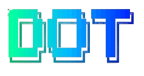

<div>
  
</div>

## Topics

Below is the general layout of my setup. Please review this _**before**_ running the install scripts.

- **bin/**: Anything in `bin/` will be added to your `$PATH` and available everywhere.
- **Brewfile**: Manages three types of applications:
  1. Brew Tap - service level tasks
  2. Brew formulas - command-line tools and packages
  3. Cask - GUI applications like Chrome, Discord, Warp, and Zoom

  **Note**: Mac App Store apps via `mas` are currently disabled due to compatibility issues with macOS Sequoia (15.x). These apps are commented out in the Brewfile and should be installed manually through the App Store.

  **You'll want to edit this file before you run the initial setup**.

- **topic/\*.zsh**: Any files ending in `.zsh` get loaded into your
  environment.
- **topic/path.zsh**: Any file named `path.zsh` is loaded first and is
  expected to set up `$PATH` or similar.
- **topic/completion.zsh**: Any file named `completion.zsh` is loaded
  last and is expected to set up autocomplete.
- **topic/\*.symlink**: Any files ending in `*.symlink` get symlinked into
  your `$HOME`. This is so you can keep all of those versioned in your dotfiles
  but still keep those autoloaded files in your home directory. These get
  symlinked in when you run `dot bootstrap` or `script/bootstrap`.

## Getting Started

### Quick Install

On a fresh macOS machine, run this one-liner to install everything:

```sh
bash -c "$(curl -fsSL https://raw.githubusercontent.com/downzer0/dotfiles/main/install.sh)"
```

This will:

1. Clone the dotfiles repository to `~/.dotfiles`
2. Run `dot bootstrap` to set up everything
3. Prompt you through Git configuration and installation

**Note**: You'll need Git installed first. On macOS, run `xcode-select --install` if you don't have it.

### Manual Installation

If you prefer more control, clone and run manually:

```sh
# Navigate to the directory
cd ~/.dotfiles

# Run the bootstrap command
dot bootstrap
# or use the legacy script
# script/bootstrap
```

### Prerequisites

Before running the installation, you may want to review and customize:

- **Brewfile**: Edit to include/exclude applications you want installed
- **zsh/zshrc.symlink**: Update paths specific to your machine
- **macos/set-defaults.sh**: Review macOS system preferences to be set

The bootstrap command will:

1. 🔧 Set up your Git configuration (name and email)
2. 🔗 Create symlinks for dotfiles in your home directory
3. 📦 Check if Homebrew is installed (installs if needed)
4. ❓ Prompt you to continue with the full installation

If you choose to continue, the installation (`dot install`) will:

1. 📦 Install all packages from the Brewfile (brew, cask, and mas apps)
2. 🔧 Set up FNM and Node.js LTS
3. ⚙️ Run all topic-specific installers (macos, fnm, zsh)
4. 🍏 Apply macOS system defaults

### Password Prompts

You may be prompted for your password a few times during installation:

1. **For FNM symlinks** (only on first run) - Creates system-wide Node.js access
2. **For macOS defaults** - Applies system-level preferences

On subsequent runs, if everything is already configured, you may not be prompted at all!

### What Gets Installed

- **Homebrew packages**: Command-line tools like git, fnm, starship, etc.
- **Cask applications**: GUI apps like Chrome, Discord, Warp, Zoom
- **Node.js**: Latest LTS version via FNM
- **Oh My Zsh**: If not already installed
- **macOS preferences**: System defaults and configurations

**Note on Mac App Store Apps**: Due to compatibility issues with `mas` on macOS Sequoia (15.x), Mac App Store apps must be installed manually. The following apps are recommended but commented out in the Brewfile:

- Be Focused (Pomodoro Timer)
- CopyClip (Clipboard Manager)
- Dato (Calendar/Time Zone App)
- Hand Mirror (Screen Mirroring)
- Keycastr (Keystroke Visualizer)
- Lungo (Prevents Sleep)
- Magnet (Window Manager)

## Keeping Things Up-to-Date

The unified `dot` command provides intelligent management for your dotfiles:

```sh
dot              # Smart updates (default - only updates what's needed)
dot update       # Same as above
dot bootstrap    # First-time setup
dot install      # Full installation
dot --edit       # Open dotfiles directory in your editor
dot --help       # Show help
```

### `dot` or `dot update` (default)

Intelligently updates only what's needed - perfect for regular maintenance:

- 🔗 Updates symlinks only if changed
- 🍺 Updates Homebrew to latest version
- 📦 Upgrades outdated packages only
- 📦 Installs missing Brewfile packages only
- 🧹 Cleans up Homebrew cache
- 🚫 Removes Homebrew's Node if detected (we use FNM)

**No unnecessary operations** - if everything is up-to-date, it will say so!

### `dot install`

Full installation - useful after major changes or pulling updates:

- 🔗 Updates all symlinks
- 📦 Installs all Brewfile packages
- ⚙️ Runs all topic installers (macOS, FNM, Zsh)
- 🍏 Applies macOS system defaults
- 🔐 Only prompts for sudo when actually needed

### `dot bootstrap`

First-time setup only - run this once when setting up a new machine:

- 📝 Sets up Git configuration (name and email)
- 🔗 Creates symlinks for dotfiles
- 🍺 Installs Homebrew if not present
- ❓ Prompts to continue with full installation

### `dot --edit`

Quickly open your dotfiles directory in your default editor (`$EDITOR`).

You can find this script in `bin/dot`.

## Version Management

This project uses [Changesets](https://github.com/changesets/changesets) to manage versions and releases.

### Creating a Changeset

When you make significant changes to the dotfiles, create a changeset:

```sh
pnpm changeset
# or
pnpm changeset:add
```

This will prompt you to:

1. Select the type of change (major, minor, or patch)
2. Provide a description of your changes

The changeset file will be created in `.changeset/` and committed with your PR.

### Release Process

When changes are merged to `main`, the GitHub Action workflow will:

1. Detect changesets and create a "Version Packages" PR
2. The PR will update the version in `package.json` and generate CHANGELOG.md
3. When the version PR is merged, it creates a Git tag for the release

### Changeset Types

- **Major** (1.x.x → 2.0.0): Breaking changes, major refactors
- **Minor** (x.1.x → x.2.0): New features, backward-compatible changes
- **Patch** (x.x.1 → x.x.2): Bug fixes, small improvements

### Quick Commands

```sh
pnpm changeset:add      # Create a new changeset
pnpm changeset:status   # View pending changesets
pnpm version            # Consume changesets and update version
pnpm release            # Create git tags for new versions
```

## Troubleshooting

### Mac App Store Apps (Mas)

The `mas` CLI tool has known compatibility issues with macOS Sequoia (15.x) and newer versions. Due to Apple's changes in the App Store authentication system:

- `mas account` and `mas signin` commands no longer work
- Installation often fails with `PKInstallErrorDomain Code=201` errors
- Even after manually "purchasing" apps, installation may fail

**Solution**: Install Mac App Store apps manually through the App Store GUI. All `mas` entries in the Brewfile are commented out by default.

### FNM and Node.js

FNM (Fast Node Manager) is used instead of nvm for better performance. Node.js binaries are symlinked to `/usr/local/bin` for system-wide access, which is particularly useful for:

- Claude MCP servers
- GUI applications that need Node.js
- System services and LaunchAgents
